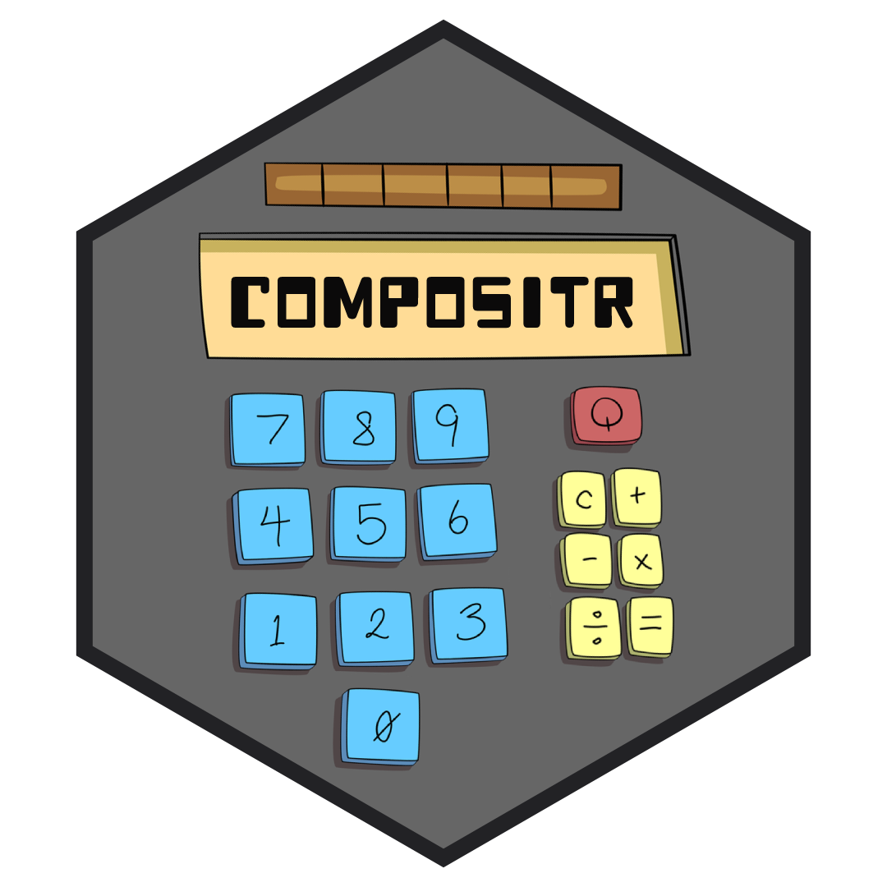

<!-- README.md is generated from README.Rmd. Please edit that file -->

# compositr </a>

<!-- badges: start -->

[](https://www.repostatus.org/#wip)
<!-- badges: end -->

## Overview

compositr makes it easy to create composite scores and build indices. It
does this by providing a suite of functions that allow you to combine
and manipulate indicators in various different ways.

## Installation

You can install the development version from
[GitHub](https://github.com/) with:

``` r
# install.packages("devtools")
devtools::install_github("britishredcrosssociety/compositr")
```

## Getting help

If you encounter a clear bug, please file an issue with a minimal
reproducible example on
[GitHub](https://github.com/britishredcrosssociety/compositr/issues).

------------------------------------------------------------------------

Please note that this project is released with a [Contributor Code of
Conduct](https://www.contributor-covenant.org/version/2/0/code_of_conduct/).
By participating in this project you agree to abide by its terms.
